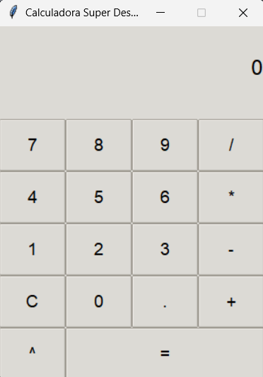
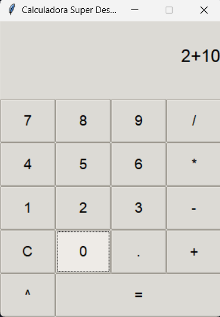
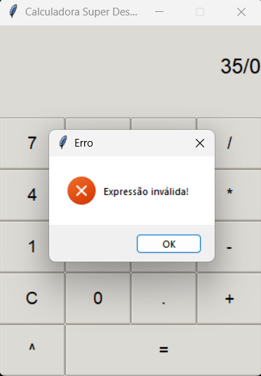

# 🧮 Calculadora GUI em Python


Este repositório apresenta uma aplicação de calculadora com interface gráfica, desenvolvida em Python, utilizando a biblioteca Tkinter/ttk.
O projeto foi elaborado como parte da resolução de um exercício proposto na disciplina Fundamentos de Sistemas de Informação, ministrada pelo docente Higor Amario de Souza, no curso de Bacharelado em Sistemas de Informação da UNESP – Universidade Estadual Paulista “Júlio de Mesquita Filho”.

---

## 📑 Funcionalidades

- **Interface Gráfica**: GUI implementada com tema `clam`, utilizando widgets `ttk` para aparência consistente.  
- **Operações Suportadas**:  
  - Adição (`+`)  
  - Subtração (`-`)  
  - Multiplicação (`*`)  
  - Divisão (`/`) com tratamento de divisão por zero  
  - Potenciação (`^`)  
- **Recursos Adicionais**:  
  - Suporte a números negativos e valores decimais  
  - Botão **C** para limpeza completa da expressão  
  - Validação de entrada e exibição de mensagens de erro por meio de diálogos  

---

## 🏁 Instruções de Uso

### Pré‑requisitos

- Python 3.10 ou superior  
- Tkinter (normalmente incluído nas instalações padrão do Python; em sistemas Linux, pode ser necessário instalar o pacote `python3-tk`)

### Passo a Passo

1. **Clone** o repositório:  
   ```bash
   git clone https://github.com/seu-usuario/calculadora-python.git
   cd calculadora-python
   ```

2. Execute a aplicação:
    ```bash
    python calculadora_gui.py
    ```

## 📂 Estrutura do Projeto

```plaintext
calculadora-python/
├── calculadora.py      # Implementação da classe Calculator e execução da GUI
├── assets/
│   ├── screenshot1.png     # Captura de tela da interface inicial
│   ├── screenshot2.png     # Captura de tela demonstrando uso da calculadora
│   └── screenshot3.png     # Captura de tela mostrando mensagem de erro
└── README.md               # Documento de instruções e descrição do projeto
```
## 📸 Capturas de Tela

### 🖥️ Interface Inicial


---

### 🔢 Exemplo de Cálculo


---

### ⚠️ Mensagem de Erro

